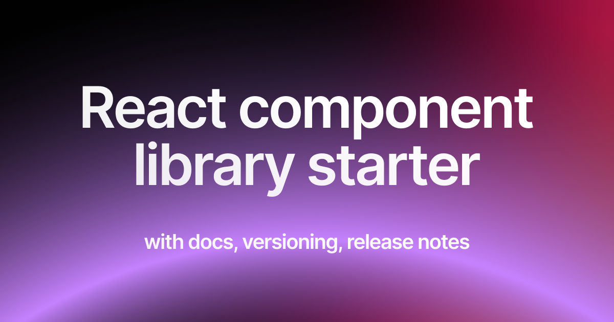

	<h1 align="center"><b>React Component Library Starter</b></h1>

    A starting point for your component library with docs, versioning, release notes
     
     
    <a href="https://rjv.im/building-react-component-library-configure-vite-tailwind">Article on setting up from scratch</a>
    ·
    <a href="https://github.com/rjvim/react-component-library-starter/issues">Issues</a>
  

## About RCLS

React Component Library Starter (RCLS) is a template designed to streamline the creation and management of component libraries. This starter kit uses Docusaurus for documentation and integrates "auto" for versioning and automated releases, making it effortless to maintain and update your library over time. If you're building a new React library from scratch, RCLS provides the tools and structure needed to succeed.

This repo has been built with two intentions:

- To help you get started building component libraries with ease
- To demonstrate how to build a component library starter

## Features

1. **Tree Shaking**: Built with [Vite's lib mode](https://vite.dev/) - Eliminates unused code during build process, reducing bundle sizes for better performance.

2. **Styling**: Integrated [Tailwind V3](https://tailwindcss.com/) (V4 Coming soon) - Utility-first CSS framework for rapid UI development with JIT compilation.

3. **Documentation**: [Docusaurus](https://docusaurus.io/) for Documentation - Modern platform with versioning and MDX support for maintaining documentation websites.

4. **Versioning**: [Auto](https://intuit.github.io/auto/index) for Versioning - Generates version numbers and changelogs based on conventional commits.

5. **Publishing**: [Auto](https://intuit.github.io/auto/index) Streamlined publishing process.

6. **Github Releases & Release Notes**: Automated with [Auto](https://intuit.github.io/auto/index) - Generates release notes and GitHub releases with categorized changes.

7. **Canary Releases for Testing**: Early access to new features - Enables testing of pre-release versions before full publishing.

## Usage

### Setup Repo

You can get started:

- Create a repo using Github's use template feature
- Or, Download zip file from Github and create a new repo using your own account

### Configure Package

There is one package in this repo, you need to rename it.

- Rename name of the package in `packages/elements/package.json`
- Adjust version to `0.0.0`
- Change name of the package in scripts too `package.json`
- Edit "author" in `.autorc`

### Install and Build

- Run `npm install`
- Run `npm run build` (We are running to make sure things are working fine)
- Run `npx auto create-labels` (These labels would be used by auto for versioning and release notes)

### Configure & Deploy Docs

Open `apps/docs/docusaurus.config.ts` and configure:

- organizationName
- projectName

And run `npm run docs:deploy`, this command would deploy docs site to Github Pages. You can adjust the `url` of the site in config based on where you would like to host your docs.

### Push to Github

After making above changes, push to `main` branch. Deploying to main branch at this point would do two things:

- Run `.github/workflows/docs-deploy.yml` action, which will deploy docs again
- Run `.github/workflows/release.yml` action which will run release pipeline, but won't publish the package

### Take a branch from main

- Copy `.env.example` to `.env` and setup npm & github tokens
- Use `git checkout -b <branch_name>` to create a new branch
- Run `npx auto canary --force` which would build and create canary release of your package

### Publish the package

- Add a "NPM_TOKEN" as Github Action Repo [Secret](https://github.com/rjvim/react-component-library-starter/settings/secrets/actions), make sure it's a secret!
- Make a small change to `packages/elements/lib/Button/index.tsx` (May color, padding etc.,)
- Write a conventional commit like: `chore: change button color`
- Push the branch to Github
- Raise a PR, add "release" label
- Merge the PR

The above steps would run release pipeline again, but this time it would make a minor release and also a Github release.

### Publish Docs

- Come back to `main` branch and pull latest changes
- Create another branch to make changes to docs
- Go into docs folder (`cd apps/docs`) and run `npm install <package-name>@version -D`
- Make changes to `apps/docs/docs/tutorial-basics/markdown-features.mdx` page using your package name
- You can test your package in docs:
  - Run `npm run docs:start`
  - Visit `/docs/tutorial-basics/markdown-features` in browser
  - You should see new color of your button
- Commit and push the change to Github, Raise PR and Merge it

This would release your docs site with new button color

### Read More

Check out the article that goes into the depth of how this repo has been set up and understand the nitty-gritty details.
